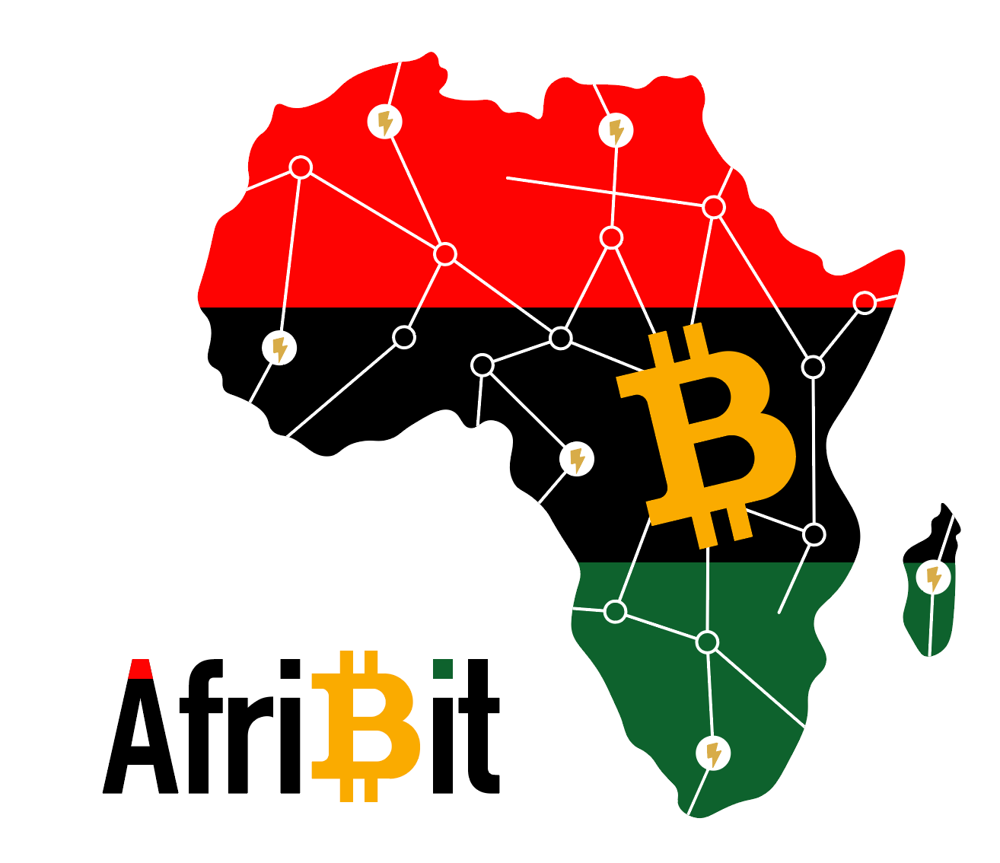

# AfriBit wallet



## Goal

This repository is the AfriBit mobile application. The goal is to make a mobile application compatible with Galoy's backend that can be customized and used by any community or organization. It is built with [React Native](https://reactnative.dev/), and runs on both iOS and Android.

## Developing

The development docs are in [DEV.md](./docs/dev.md)

## Contributing

If you wish to contribute see [CONTRIBUTING.MD](./CONTRIBUTING.MD)

### _Notes for Running on M1 Mac:_

The app currently only builds for x86_64 simulators. Simulators prior to IOS 13.7 are x86_64 by default, however starting with 13.7 they become platform specific. In order to get an x86_64 simulator of a newer IOS version, one must set XCode to open in [emulation using Rosetta](https://www.macworld.com/article/338843/how-to-force-a-native-m1-mac-app-to-run-as-an-intel-app-instead.html). To run the project, open [GaloyApp.xcworkspace](./ios/GaloyApp.xcworkspace/) in XCode, choose an x86_64 simulator, and click the play button. This should start the Metro bundler in a new terminal as well as launch the simulator with the app.

## Running the app, quickstart guide

First, install the packages using the following command:

   ```bash
   yarn install
   ```

Second, prepare the assets for the platform of your choice:

   ```bash
   yarn android:prepareAssets
   ```

Third, build the project into a debug package:

   ```bash
   yarn android:buildDebug
   ```

Last but not least, run the server with:

   ```bash
   yarn start
   ```

and wait until it prompts you for the platform of your choice.